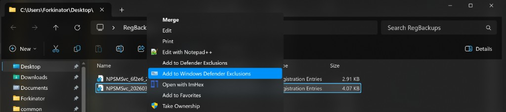

# DefenderExclusionContextMenu

[](./LICENSE)

Simple PowerShell utility that adds a right-click Explorer menu item for files and folders:

- **Add to Windows Defender Exclusions**

When clicked, it adds the selected file/folder path to Microsoft Defender's exclusion list.

## What it does

- Installs context menu entries for both files and directories.
- Uses user-scoped registry keys (`HKCU\Software\Classes`) for install/uninstall.
- Elevates with UAC only when the exclusion action is triggered.
- Prevents duplicate exclusions.

## File in this repository

- `Install-DefenderExclusionContextMenu.ps1`

## Requirements

- Windows 10/11
- PowerShell 5.1+ (or PowerShell 7 with Defender module available)
- Microsoft Defender enabled
- Administrator approval (UAC prompt) when actually adding exclusions

## Usage

Run PowerShell in the repository folder.

### 1) Install the right-click menu item

```powershell
powershell -NoProfile -ExecutionPolicy Bypass -File ".\Install-DefenderExclusionContextMenu.ps1" -Install
```

### 2) Use it from Explorer

- Right-click any file or folder.
- Click **Add to Windows Defender Exclusions**.
- Approve the UAC prompt.

### 3) Uninstall the right-click menu item

```powershell
powershell -NoProfile -ExecutionPolicy Bypass -File ".\Install-DefenderExclusionContextMenu.ps1" -Uninstall
```

## Preview (Screenshot / GIF)

Add your visuals to the `assets` folder with these names:

- `assets/context-menu.png` (Explorer right-click menu screenshot)
- `assets/demo.gif` (short install/use demo)

Then uncomment this section in the README:

```markdown
### Context Menu


### Demo

```

## Notes

- The script calls `Add-MpPreference -ExclusionPath`.
- Existing exclusions are detected and skipped.
- Exclusions reduce Defender scanning coverage. Only exclude trusted paths.
